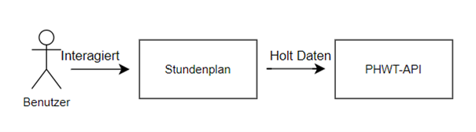

### 1. Einleitung

**Ziel:**

Diese Dokumentation beschreibt die Entwicklung eines Frontends für die PHWT-Stundenplan-API. Das Frontend ermöglicht Studenten und Professoren (und in Zukunft ggf. dem Sekretariat) die komfortable Einsicht in ihre Stundenpläne.

**Motivation:**

Die Nutzung der PHWT-Stundenplan-API direkt ist für die meisten Nutzer umständlich und unkomfortabel. Daher soll ein nutzerfreundliches Frontend entwickelt werden, das die wichtigsten Funktionen der API einfach zugänglich macht.

### 2. Anforderungen

**Kompatibilität:**

* Die Anwendung muss auf allen gängigen Endgeräten (z.B. Desktop-PCs, Laptops, Tablets, Smartphones) lauffähig sein und auf jedem Gerät eine optimale Darstellung bieten.

**Zuverlässigkeit:**

* Die Anwendung muss die Daten der PHWT-Stundenplan-API korrekt und fehlerfrei anzeigen.

**Stabilität:**

* Die Anwendung muss jederzeit stabil und verfügbar sein. Abstürze oder Fehler sollten ausgeschlossen sein.

### 3. Randbedingungen und Kontextabgrenzung

**Datenquelle:**

* Die Anwendung nutzt ausschließlich die Daten der PHWT-Stundenplan-API.

**Zielgruppe:**

* Die Anwendung richtet sich an Studenten, Professoren und (in Zukunft ggf.) das Sekretariat der PHWT.

**Technische Umgebung:**

* **Plattform:** NodeJS
* **Framework:** ReactJS
* **API-Kommunikation:** Fetch

**Entwicklungszyklus:**

* Die PHWT-Stundenplan-API wird von Studenten jedes Jahr modifiziert. Daher muss die Anwendung flexibel genug sein, um an diese Änderungen angepasst werden zu können.

### 4. Lösungsstrategie

**Sichere Anmeldung:**

* Verwendung der PHWT-API für die Validierung der Anmeldeinformationen.
* Kodierung der Anmeldeinformationen auf der Benutzerseite.
* Übertragung der Anmeldeinformationen per HTTPS.

**Behalten der Session:**

* Speicherung von Access- und Refresh-Tokens im Browser des Benutzers nach erfolgreicher Anmeldung.
* Verwendung der Tokens für die weitere Authentifizierung bei der API.

**Anzeige des korrekten Stundenplans:**

* Darstellung der vom API zurückgelieferten Vorlesungsdaten in einer übersichtlichen und nutzerfreundlichen Weise.

### 5. Laufzeitsicht

**Abbildung:**

**Beschreibung:**

Die Abbildung zeigt die Interaktion der Anwendung mit der Infrastruktur.

* Benutzer interagieren mit dem Stundenplan.
* Der Stundenplan holt die Vorlesungsdaten von der PHWT-API.

### 6. Entwurfsentscheidungen

**ReactJS:**
* ReactJS wurde als Framework gewählt, da es eine hohe Performance und eine große anzahl von Bibliotheken bietet.

**NodeJS:**
* NodeJS ermöglicht die einfache Entwicklung von Anwendungen und die Verwendung von Bibliotheken und Frameworks wie ReactJS.

**Fetch:**
* Fetch ist eine API zum Abrufen von Daten aus dem Internet. Diese wird genutzt um mit dem Backend zu kommunizieren.

### 7. Architekturdesign

**Single-Page-Application (SPA):**

* Die Anwendung wird als SPA entwickelt.
* Die gesamte Anwendung wird in einer einzigen HTML-Datei geladen.
* Der Inhalt wird dynamisch aktualisiert, ohne dass die Seite neu geladen werden muss.

**Modulare Architektur:**

* Die Architektur der Anwendung ist modular aufgebaut.
* Die Module kommunizieren miteinander.

**Vorteile:**

* Hohe Wartbarkeit
* Erweiterbarkeit

### 8. Implementierung

**Schritte:**

1. Anforderungen des Backends:
    * Analyse der PHWT-API-Dokumentation
2. Entwicklung des Frontends:
    * Entwicklung mit NodeJS und ReactJS
    * Bereitstellung der Benutzeroberfläche
3. Integration von Backend und Frontend:
    * Verbindung der beiden Systeme
    * Ermöglichung der Datenübertragung und Authentifizierung
4. Debugging und Fehlerbehebung:
    * Debugging der Anwendung
    * Beheben von Fehlern
5. Deployment:
    * Bereitstellung der Anwendung auf einem Server
    * Zugänglichmachung für die Nutzer

### 9. Fazit

**Vorteile der Entwicklung eines Frontends:**

* Komfortable Nutzung
* Übersichtliche Darstellung der Stundenpläne
* Gute Performance
* Erweiterbarkeit

**Zukunft:**

* Weitere Entwicklung und Verbesserung der Anwendung
* Anpassung an die Bedürfnisse der Nutzer
